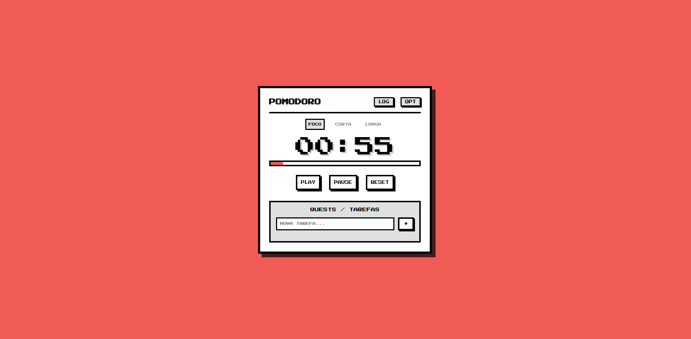

# Pomodoro Timer

Um site de temporizador Pomodoro, feito em HTML, CSS e JavaScript puros, com uma estética cozy e pixel art.

> ✅ **Projeto finalizado** — todas as funcionalidades planejadas foram implementadas.

## Sobre o projeto

A técnica Pomodoro ajuda a organizar o tempo de estudo/trabalho em ciclos de foco e descanso, alternando períodos de concentração intensa com pequenas pausas. Este projeto é uma versão própria desse timer, construída do zero como prática de HTML, CSS e JavaScript puros — sem frameworks ou bibliotecas externas.

Além do timer, o site conta com um sistema de tarefas integrado, permitindo organizar o que precisa ser feito durante as sessões de foco — tudo com uma estética pixel art que deixa a experiência mais leve e convidativa.

## Funcionalidades

- Temporizador com **3 modos**: **Foco**, **Curta** (descanso curto) e **Longa** (descanso longo)
- Botões de **Play**, **Pause** e **Reset** para controlar o ciclo atual
- Barra de progresso visual mostrando o andamento do ciclo
- Sistema de **Quests/Tarefas**: adicione tarefas, marque como concluídas ou remova-as
- Botão **LOG**, para visualizar o histórico de ciclos concluídos
- Botão **OPT**, para acessar as opções/configurações do timer
- Interface com estética cozy/pixel art, fundo em destaque e tipografia pixelada
- Layout responsivo, funcionando bem em desktop e mobile

## Preview



## Como usar

1. Clone o repositório:
```bash
   git clone https://github.com/seu-usuario/nome-do-repositorio.git
```
2. Abra o arquivo `index.html` no navegador (não é necessário nenhuma instalação ou servidor).
3. Escolha o modo desejado (**Foco**, **Curta** ou **Longa**) e clique em **Play** para começar.
4. Adicione suas tarefas na seção **Quests/Tarefas** para acompanhar o que precisa ser feito.
5. Use **LOG** para ver seu histórico e **OPT** para ajustar as configurações.

Ou acesse direto pelo GitHub Pages: `https://mary-mrtns.github.io/Pomodoro/`

## Tecnologias Usadas

- **HTML5** — estrutura da página
- **CSS3** — estilização, responsividade e animações
- **JavaScript** — lógica do timer, ciclos, tarefas e histórico
